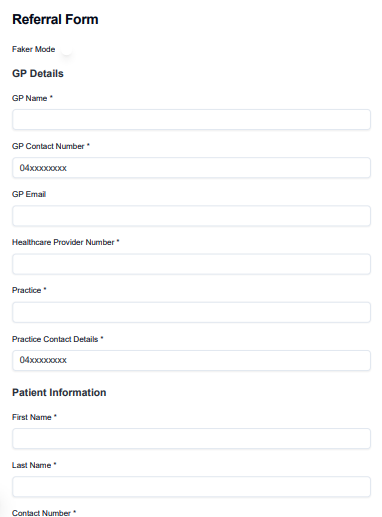
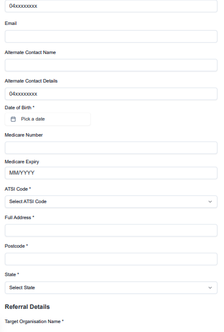
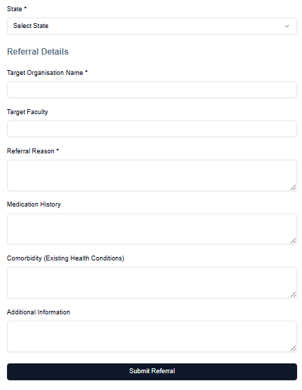

## 🚀──────────────────────────────────🚀


# Referral Form with Zod Validation

## Overview

This project implements a **Referral Form** with **Zod** validation to ensure that all fields adhere to specific validation rules. The form collects essential information about:

- **Clinician (General Practitioner) Details**
- **Patient Information**
- **Referral Information**\
\
\
\


Each field in the form is validated using **Zod**, ensuring that the data is in the correct format, contains valid values, and meets required constraints.

## Project Structure

The project contains several sections, each with its own form fields and validation rules. The validation is done using **Zod**, ensuring that every input is validated based on the requirements defined for the field type.

### Form Fields and Validation Rules

#### 1. Clinician (General Practitioner) Details

| **Field**                    | **Type**       | **Validation Rules**                                               |
|------------------------------|----------------|-------------------------------------------------------------------|
| GP Name                      | Text           | Required, Max: 255 characters                                     |
| GP Contact Number            | Phone          | Required, Valid phone format                                      |
| GP E-mail                    | Email          | Optional                                                           |
| Healthcare Provider Number   | Text           | Required, Max: 50 characters                                       |
| Practice Name                | Text           | Required, Max: 255 characters                                     |
| Practice Contact Details     | Phone/Email    | Required, Must be valid phone or email format                     |

#### 2. Patient Information

| **Field**                           | **Type**       | **Validation Rules**                                               |
|-------------------------------------|----------------|-------------------------------------------------------------------|
| Patient First Name                 | Text           | Required, Max: 255 characters                                      |
| Patient Last Name                  | Text           | Required, Max: 255 characters                                      |
| Patient Contact Number             | Phone          | Required, Valid phone format                                       |
| Patient E-mail                     | Email          | Optional                                                           |
| Gender                             | Dropdown       | Required, Male, Female, Non-binary, Other, Prefer not to say       |
| Patient Alternate Contact Name     | Text           | Optional, Max: 255 characters                                      |
| Patient Alternate Contact Details  | Phone/Email    | Optional, Must be valid phone or email format                      |
| Patient Date of Birth              | Date           | Required, Must be a valid past date                                |
| Medicare Number                    | Text           | Optional, 10-15 characters, Numeric only                           |
| Medicare Expiry                    | Date           | Required, Must be a future date                                    |
| ATSI Code                          | Integer        | Required, Predefined values (Aboriginal, Torres Strait Islander, etc.) |
| Patient Full Address               | Text           | Required, Max: 500 characters                                      |
| Patient Postcode                   | Text           | Required, 4-digit numeric                                          |
| Patient State                      | Dropdown       | Required, [Australian states]                                      |

#### 3. Referral Information

| **Field**                         | **Type**       | **Validation Rules**                                               |
|-----------------------------------|----------------|-------------------------------------------------------------------|
| Target Organisation Name         | Text           | Required, Max: 255 characters                                      |
| Target Faculty                    | Text           | Optional, Max: 255 characters                                      |
| Referral Reason                  | Text Area      | Required, Max: 1000 characters                                    |
| Medication History               | Text Area      | Optional, Max: 1000 characters                                    |
| Comorbidity                      | Text Area      | Optional, Max: 1000 characters                                    |
| Additional Information           | Text Area      | Optional, Max: 1000 characters                                    |

## Zod Schema Validation

Zod is used to handle form validation. Here's how the validation is structured for each form section:

### 1. Clinician (General Practitioner) Details

```typescript
import { z } from "zod";

const gpDetailsSchema = z.object({
  name: z.string().min(1, "GP Name is required").max(255, "Must be 255 characters or less"),
  email:z
  .string()
  // handle optional case
  .refine((val) => val === undefined || val.trim() === "" || valid_email_regex.test(val), {
    message: "Invalid email address", // Custom error message for invalid email format
  }),
  contact_number: z.string().regex(valid_contact_regex, { message: "Phone number must be a valid Australian number." }),
  healthcare_provider_number: z.string().min(1, "Healthcare Provider Number is required").max(50, "Must be 50 characters or less"),
  practice_name: z.string().min(1, "Practice Name is required").max(255, "Must be 255 characters or less"),
  practice_contact_number:  z.string().regex(valid_contact_regex, { message: "Phone number must be a valid Australian number." }),
});
```

### 2. Patient Information
```typescript
 // Patient Information
const patientInformationsSchema= z.object({
  first_name: z.string().min(1, "First Name is required").max(255, "Must be 255 characters or less"),
  last_name: z.string().min(1, "Last Name is required").max(255, "Must be 255 characters or less"),
  contact_number: z.string().regex(/^04\d{8}$/, { message: "Phone number must be a valid Australian mobile number (e.g., 0422018632)." }),
  email: z
  .string()
  // handle optional case
  .refine((val) => val === undefined || val.trim() === "" || valid_email_regex.test(val), {
    message: "Invalid email address", // Custom error message for invalid email format
  }),
  alternate_contact_name: z.string().max(255, "Must be 255 characters or less").optional(),
  alternate_contact_number: z.string().transform((val) => (val.trim() === "" ? undefined : val)).optional().refine((val) => val === undefined || val.match(valid_contact_regex), {
    message: "Alternate Contact Number must be a valid Australian mobile number (e.g., 0422018632).",
  }),
  dob: z.date({
    required_error: "Date of Birth is required",
  }).refine((dob) => dob < new Date(), {
    message: "Date of Birth must be in the past",
  }),
  medicare_number: z
  .string()
  // handle optional case
  .refine((val) => val === undefined || val.trim()===""|| val.match(/^\d{10,15}$/) , {
    message: "Medicare Number must be numeric and between 10 and 15 digits",
  }),
  medicare_expiry: z
  .string()
  .transform((val) => (val.trim() === "" ? undefined : val)) // Convert empty string to undefined
  .refine((val) => val === undefined || val.trim()===""|| val.match(/^(0[1-9]|1[0-2])\/\d{4}$/)  // Check if date matches MM/YYYY format
  , { message: "Medicare must be in MM/YYYY format" })
  .refine((val) => {
    if (val === undefined) return true; // Skip future date check if value is undefined
    const [month, year] = val.split('/');
    const expiryDate = new Date(`${year}-${month}-01`);
    expiryDate.setMonth(expiryDate.getMonth() + 1); // Add 1 month to the expiry date to get the last day of the  prev month (e.g., 03/2025 -> expiry valiid before 01/04/2025)
    return isFutureDate(expiryDate); // Check if the expiry date is in the future
  }, { message: "Expiry date must be in the future" }),
  atsi_code: z.enum(["1","2","3","4"], {
    required_error: "ATSI Code is required",
  }),
  full_address: z.string().min(1, "Full Address is required").max(255, "Must be 255 characters or less"),
  post_code: z.string().regex(/^\d{4}$/, "Postcode must be a 4-digit number"), // Validate that it's a 4-digit number
  state: z.enum(["NSW", "VIC", "QLD", "WA", "SA", "TAS", "ACT", "NT"], { required_error: "State is required" }),
  
});

```
### 3. Referral Information

```typescript
const referralDetailsSchema = z.object({
  target_organization_name: z.string().min(1, "Target Organisation Name is required").max(255, "Must be 255 characters or less"),
  target_faculty: z.string().max(255, "Must be 255 characters or less").optional(),
  reason: z.string().min(1, "Referral Reason is required").max(1000, "Must be 1000 characters or less"),
  medication_history: z.string().max(1000,"Must be 1000 character or less").optional(),
  comorbidity: z.string().max(1000,"Must be 1000 character or less").optional(),
  additional_info: z.string().max(1000,"Must be 1000 character or less").optional(), 
});
```

## How to Use
### Prerequisites
Before using this application, make sure you have Node.js installed. You can download it from [Node.js Official Website.](https://nodejs.org/)

### Steps to Run

**1. Clone the Repository:**\
Clone the repository to your local machine:

```bash
git clone <repository_url>
cd <project_directory>
```

**2. Install Dependencies:**\
Run the following command to install all required dependencies:
```bash
npm install
```
**3. Run the Application:**\
Start the development server:
```bash
npm run dev
```
This will start the application on `http://localhost:3000` by default.

**4. Test the Form:**
- Navigate to the referral form page `http://localhost:3000/referral/create`.
- Fill out the form and submit it.
- If any field is invalid, an error message will appear based on the Zod validation.

## Disclaimer

Please note that this website and referral form are **for demonstration purposes only**. It is not intended for actual referral submissions or to be used in a live healthcare environment. Any data submitted through this form is not stored, processed, or sent to any real medical institutions.

For more details, please review the following documents:

- [Terms & Conditions](#) - Terms and conditions for using this site.
- [Privacy Policy](#) - Information on how data is handled and protected.
